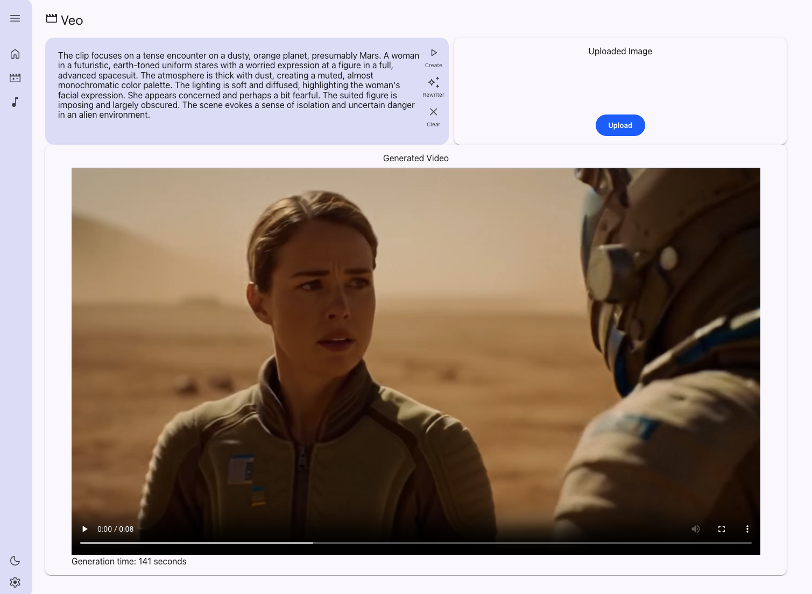
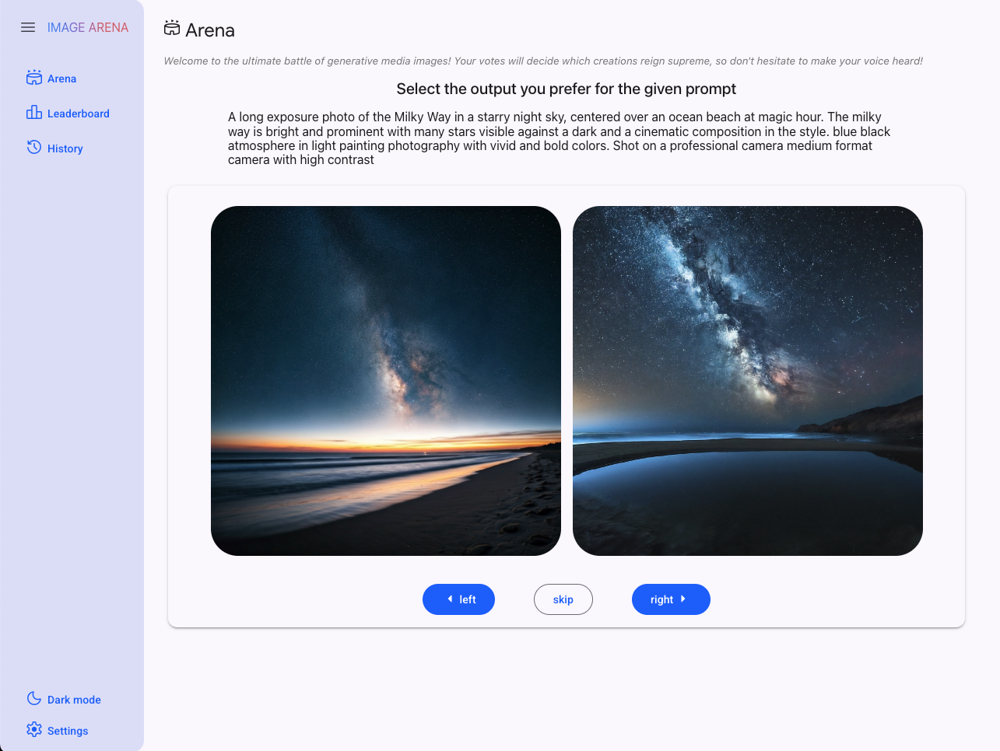
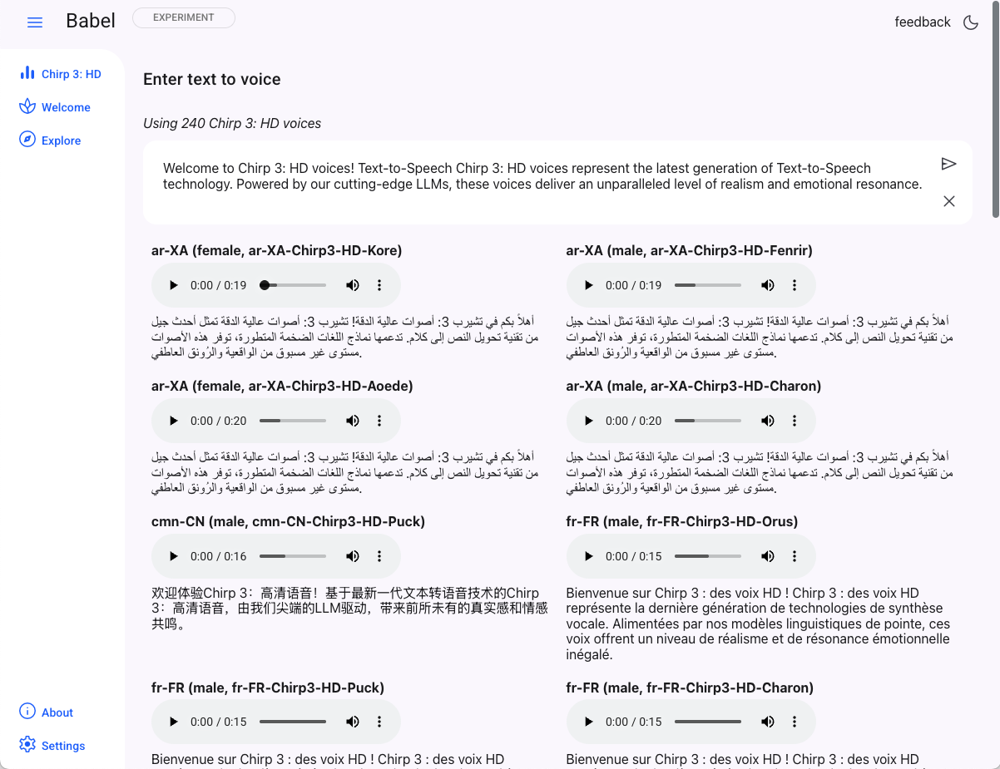

# GenMedia Creative Studio: Experiments

__Welcome to the Experimental folder!__

The experimental folder contains amazing stand-alone applications and features not yet ready for inclusion into the main app.

We'd love to hear your feedback on these!

## Table of Contents

**Genmedia Creative Studio**
* [Genmedia Creative Studio v.Next](#genmedia-creative-studio-vnext) - v.next of Genmedia creative studio

**MCP Tools for Genmedia**
* [MCP Tools for Genmedia](#mcp-tools-for-genmedia) - MCP Servers for Genmedia services

**Combined Workflows**
* [Storycraft](#storycraft) - An AI-powered video storyboard generation platform.
* [Creative GenMedia Workflow](#creative-genmedia-workflow) - a Creative GenMedia workflow which takes various inputs to create prompts for Veo 3, plus allows a showcase of output videos.

**Prompting Techniques**
* [Promptlandia](#promptlandia) - a powerful web application that helps you analyze, refine, and improve your prompts using AI-powered feedback.
* [Veo Genetic Prompt Optimizer](#veo-genetic-prompt-optimizer) - an automated system that uses a genetic algorithm to evolve and refine high-level "metaprompts," that guides Gemini to generate superior, task-specific prompts for Google's Veo video generation model.
* [Veo 3 Character Consistency](#veo-3-character-consistency) - a workflow for generating a video of a person in a new scene while maintaining character consistency.
* [Veo 3 Item Consistency](#veo-3-item-consistency) - a workflow for generating a video of an item in a new scene while maintaining item consistency.
* [VeoStart](#veostart) - a prompt creator assistant for Veo 2 & Veo 3

**Audio**
* [Creative Podcast Assistant](#creative-podcast-assistant) - a notebook example to create a podcast with genmedia services
* [Babel](#babel---chirp-3-hd-voices) - experiment with Chirp 3 HD voices

**Image**
* [Imagen Product Recontextualization at Scale](#imagen-product-recontextualization-at-scale) - a set of notebooks for the Imagen Product Recontext model to run at scale.
* [Virtual Try-On](#virtual-try-on) - a notebook example for virtually trying on outfits at scale.

**Image Comparison**
* [Arena](#arena---rate-images) - rate your images with in a visual arena

## Storycraft

An AI-powered video storyboard generation platform that transforms text descriptions into complete video narratives using Google's generative AI models. Create cinematic scenes, generate voiceovers, compose music, and export professional videos with a modern web interface.

See [Storycraft](./storycraft/)

## Creative GenMedia Workflow

An end-to-end workflow demo that demonstrates how a series of interconnected AI tools can be orchestrated to produce high-quality, on-brand creative media. The demo does the following:
- Takes initial inputs - product details, images, brand guidelines, and a simple brief - and transforms them into a concrete creative output: a detailed video prompt ready for generation with [Veo 3](https://cloud.google.com/vertex-ai/generative-ai/docs/models#veo-models).
- Includes a showcase to display pre-made examples, which is crucial for demonstrating the final output without the delay of live video generation.

See [Creative GenMedia Workflow demo](./creative-genmedia-workflow/)

## Promptlandia

Stop guessing and start engineering your prompts! Promptlandia is a powerful web application that helps you analyze, refine, and improve your prompts using AI-powered feedback. Whether you're a seasoned prompt engineer or just getting started, this tool will help you get better results from your generative AI models.

See [Promptlandia](./promptlandia/)

## Veo Genetic Prompt Optimizer

A sophisticated, automated system designed to enhance the quality of video generation from  Google's Veo model. It employs a genetic algorithm to evolve and optimize "metaprompts," which are high-level instructions that guide Gemini in rewriting user-provided base prompts into more detailed and effective versions for Veo. The process involves generating  an initial population of metaprompts, evaluating their fitness based on the quality of the augmented prompts they produce and their ability to   preserve user intent, and then using selection, crossover, and mutation to breed better metaprompts over multiple generations. The system can  also optionally generate videos from the augmented prompts and use an LLM-based judge to evaluate the video quality, feeding this information   back into the evolutionary process to further refine the metaprompts. The ultimate goal is to discover an optimal metaprompt that consistently  produces superior, task-specific prompts for Veo, leading to higher-quality video outputs.

See [Veo Genetic Prompt Optimizer](./veo-genetic-prompt-optimizer/)

## Veo 3 Character Consistency

This application demonstrates a workflow for generating a video of a person in a new scene while maintaining character consistency. It uses a series of Google AI models to analyze input images, generate a new scene with the person, and then create a video from that scene.

See [Veo 3 Character Consistency](./veo3-character-consistency/)

## Veo 3 Item Consistency

This application demonstrates a workflow for generating a video of an item in a new scene while maintaining item consistency. It uses a series of Google AI models to analyze input images, generate a new scene with the item, and then create a video from that scene.

See [Veo 3 Item Consistency](./veo3-item-consistency/)

## VeoStart

VeoStart is a web-based tool designed to help users craft high-quality, effective prompts for Google's Veo video generation model. It provides a structured interface for building prompts from scratch and a gallery of examples to inspire creativity.

See [VeoStart](./VeoStart/)

## MCP Tools for Genmedia

Model Context Protocol servers for Genmedia services for AI applications to utilize Veo, Imagen, Lyria, Chirp 3 HD, along with a composition service, avtool.

See [MCP Genmedia](./mcp-genmedia/)

## Genmedia Creative Studio v.Next

A stand-alone application for generative video creation with Veo!

See [v.Next UI](./veo-app/)

## Creative Podcast Assistant

* notebook example - create a podcast from audio and other sources

## Arena - rate images

A stand-alone application to rate Model Garden image generation models, including Imagen 2, 3 and others!

## Imagen Product Recontextualization at Scale

This repository contains Jupyter notebooks and tools to perform large-scale product image recontextualization using Google's Gemini and Imagen Product Recontext models. It includes both the generation pipeline and an evaluation framework.

See [Imagen Product Recontextualization at Scale](./Imagen_Product_Recontext/)

## Virtual Try-On

This notebook demonstrates how to use a generative AI model for Virtual Try-On, allowing users to visualize various outfits on a person's image. It leverages the Google Cloud Vertex AI Prediction API to simulate how different outfits would appear when virtually worn and includes suggestions for scaling the solution.

See [Virtual Try-On](./VTO/)

## Babel - Chirp 3: HD Voices

A stand-alone service + web application that generates voices using Google Cloud's Chirp 3: HD Voices.

