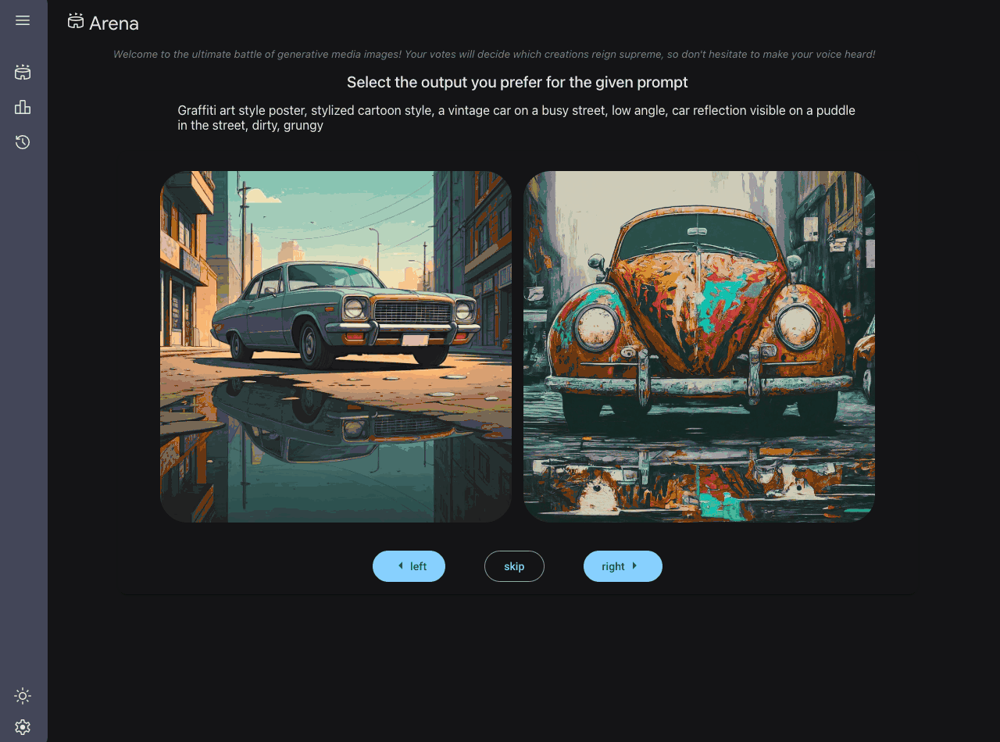

# Image Generation Arena & Leaderboard

This is an example of an arena & leaderboard to compare different image generation tools.

Currently, it uses Flux1, Stable Diffusion, Imagen 2, Imagen 3, image generation models with Gemini 2.0 experimental's image output model forthcoming.

The application is written in [Mesop](https://google.github.io/mesop/), a python UX framework, with the [Studio Scaffold starter](https://github.com/ghchinoy/studio-scaffold).




## Prerequisites

The following APIs are required in your project:

1. Vertex AI API
1. Dataform API
1. Compute Engine API
1. Cloud Storage

### Python environment

A python virtual environment, with required packages installed.

Using [uv](https://github.com/astral-sh/uv):

```bash
# create a virtual environment
uv venv venv
# activate the virtual environ,ent
. venv/bin/activate
# install the requirements
uv pip install -r requirements.txt
```

### Cloud Firestore

We will be using [Cloud Firestore](https://firebase.google.com/docs/firestore), a NoSQL cloud database that is part of the Firebase ecosystem and built on Google Cloud infrastructure, to save generated image metadata and ELO scores for the leaderboard.

> If you're new to Firebase, a great starting point is [here](https://firebase.google.com/docs/projects/learn-more#firebase-cloud-relationship).

Go to your Firebase project and create a database. Instructions on how to do this can be found [here](https://firebase.google.com/docs/firestore/quickstart).

Next do the following steps:

1. Create a collection called `arena_images`.
1. Create a collection called `arena_elo`
1. Create an index for `arena_elo` with two fields: `type` set to `ASC` and `timestamp` set to `DESC` and query scope set to `Collection Group`.

The name of the collections can be changed via environment variables in the `.env` file. i.e. `IMAGE_COLLECTION_NAME` and `IMAGE_RATINGS_COLLECTION_NAME`, respectively.

To verify your index has been created successfully, run the following command:

```bash
firebase firestore:indexes --database <DATABASE_NAME> --project <YOUR_PROJECT_ID>
```

The output should look like this:

```json
{
  "indexes": [
    {
      "collectionGroup": "arena_elo",
      "queryScope": "COLLECTION_GROUP",
      "fields": [
        {
          "fieldPath": "type",
          "order": "ASCENDING"
        },
        {
          "fieldPath": "timestamp",
          "order": "DESCENDING"
        }
      ]
    }
  ],
  "fieldOverrides": []
}
```

### Cloud Spanner

Cloud Spanner is used to persist the ELO scores, per model, for each rating done into a table called `Study`.

> **IMPORTANT:** As a prerequisite, create an instance of Cloud Spanner with 100 processing units from the Cloud Console. Instructions can be found [here](https://cloud.google.com/spanner/docs/getting-started).

Next, change the following environment variables or use the default values already set in the `.env.template` file.

```bash
PROJECT_ID=<YOUR_PROJECT_ID>
SPANNER_INSTANCE_ID="arena"
SPANNER_DATABASE_ID="study"
```

Now run the following script to create the tables and indexes.  

```bash
python3 -m scripts.setup_study_db
```

#### Benefits of the `Study` Table

The `Study` table, designed to store Elo ratings for various models over time, offers significant benefits for understanding and analyzing the various AI models performance in the arena. It allows for interesting insights and queries to be extracted for further analysis. Some benefits are mentioned below:

1. **Historical Performance Tracking:** The inclusion of the `time_of_rating` column allows for a comprehensive history of each model's Elo rating. This enables you to see how a model's perceived quality or performance evolves over time, potentially reflecting the impact of model updates, or changes in user preferences.

2. **Model Comparison Over Time:** By storing ratings for multiple models in the same table, you can directly compare their Elo scores at any given point or across specific timeframes. This facilitates the identification of top-performing models and the tracking of competitive dynamics.

3. **Contextual Analysis Through the `study` Column:** The `study` column provides a crucial context for the ratings. You can categorize different evaluation sessions or experiments, allowing you to analyze model performance under specific conditions or within particular studies. For example, `live` generations vs `bulk` generations of images. 

4. **Scalable and Queryable Data:** Built on Cloud Spanner, the table offers horizontal scalability and strong consistency, ensuring you can store and query large volumes of rating data efficiently. The structured nature of the table allows for complex analytical queries.

#### Interesting Queries You Can Run

1. **Track Elo Score Over Time for a Specific Model:**

    ```sql
    SELECT time_of_rating, rating
    FROM Study
    WHERE model_name = 'your_model_name'
    ORDER BY time_of_rating ASC;
    ```

2. **Compare Elo Scores of Multiple Models at a Specific Time:**

    ```sql
    SELECT model_name, rating
    FROM Study
    WHERE time_of_rating = 'specific_timestamp'
    ORDER BY rating DESC;
    ```

3. **Find the Average Elo Score of a Model Within a Specific Study:**

    ```sql
    SELECT model_name, AVG(rating) AS average_rating
    FROM Study
    WHERE study = 'your_study_name'
    GROUP BY model_name
    ORDER BY average_rating DESC;
    ```

4. **Identify the Model with the Highest Elo Score in a Specific Study Over a Time Range:**

    ```sql
    SELECT model_name, MAX(rating) AS max_rating
    FROM Study
    WHERE study = 'your_study_name'
    AND time_of_rating >= 'start_timestamp'
    AND time_of_rating < 'end_timestamp'
    GROUP BY model_name
    ORDER BY max_rating DESC
    LIMIT 1;
    ```

#### Types of Studies You Can Run

The `Study` table is versatile and can support various types of studies focused on evaluating generative AI models:

1. **Live Arena Studies:** As you are currently implementing, this table can track Elo ratings derived from real-time user comparisons of model outputs. Each arena session or a series of sessions can be grouped under a specific `study` name (e.g., "live_arena_round_1", "live_arena_round_2").

2. **A/B Testing of Model Versions:** You can run studies comparing different versions of the same model (e.g., "imagen-3.0-generate-001" vs. "imagen-3.0-generate-002") on the same prompts. Each version would be recorded as a distinct `model_name`, and the overall experiment can be identified by a `study` name (e.g., "imagen_v1_v2_comparison").

3. **Impact of Hyperparameter Tuning:** Studies where you evaluate the effect of different hyperparameter settings on model performance. Each set of hyperparameters can be associated with a unique `study`.

4. **Prompt Engineering Effectiveness:** You can analyze how different prompting strategies affect the perceived quality of model outputs. Each prompting strategy could define a separate `study`.

5. **Comparison Across Different Model Architectures:** Evaluating the relative performance of models with different underlying architectures (e.g., "Imagen" vs. "Stable Diffusion") within the same study.

6. **Longitudinal Studies:** Tracking the performance of a set of baseline models over an extended period to observe trends and identify potential degradation or improvement.

### Application environment vars

Images are generated and stored in a Google Cloud Storage bucket.

The repository has a file named `.env.template` that you can use as a template.

> **IMPORTANT:** Rename `.env.template` to `.env` and fill in your entries.

```bash
PROJECT_ID=<YOUR_PROJECT_ID>
GENMEDIA_BUCKET=${PROJECT_ID}-genmedia
GEMINI_PROJECT_ID=<YOUR_PROJECT_ID_WITH_GEMINI_API_ACCESS>
LOCATION="us-central1"
MODEL_ID="gemini-2.0-flash"
IMAGE_FIREBASE_DB="arena"
IMAGE_COLLECTION_NAME="arena_images"
IMAGE_RATINGS_COLLECTION_NAME="arena_elo"
ELO_K_FACTOR=32
MODEL_FLUX1_ENDPOINT_ID=<YOUR_FLUX1_MODEL_ENDPOINT_ID> # This is the endpoint ID for the Flux1 model in Model Garden
MODEL_STABLE_DIFFUSION_ENDPOINT_ID=<MODEL_STABLE_DIFFUSION_ENDPOINT_ID> # This is the endpoint ID for the StableDiffusion model in Model Garden
```

## Arena app

Start the app to explore

```bash
mesop main.py
```

## Deployment

### Service Account

Create a Service Account to run your service, and provide the following permissions to the Service Account

* Cloud Run Invoker
* Vertex AI User
* Cloud Datastore User
* Storage Object User

```bash
export PROJECT_ID=$(gcloud info --format='value(config.project)')

export DESC="genmedia arena"
export SA_NAME="sa-genmedia-arena"
export SA_ID=${SA_NAME}@${PROJECT_ID}.iam.gserviceaccount.com

# create a service account
gcloud iam service-accounts create $SA_NAME --description $DESC --display-name $SA_NAME

# assign vertex and cloud run roles
gcloud projects add-iam-policy-binding $PROJECT_ID --member="serviceAccount:${SA_ID}" --role "roles/run.invoker"
gcloud projects add-iam-policy-binding $PROJECT_ID --member="serviceAccount:${SA_ID}" --role "roles/aiplatform.user"
gcloud projects add-iam-policy-binding $PROJECT_ID --member="serviceAccount:${SA_ID}" --role "roles/storage.objectUser"
gcloud projects add-iam-policy-binding $PROJECT_ID --member="serviceAccount:${SA_ID}" --role "roles/datastore.user"
```

### Deploy

```bash
gcloud run deploy genmedia-arena --source . \
    --service-account=$SA_ID \
    --set-env-vars GENMEDIA_BUCKET=${PROJECT_ID}-genmedia \
    --set-env-vars PROJECT_ID=${PROJECT_ID} \
    --set-env-vars MODEL_ID=gemini-2.0-flash \
    --region us-central1
```

## Disclaimer

This is not an official Google project
