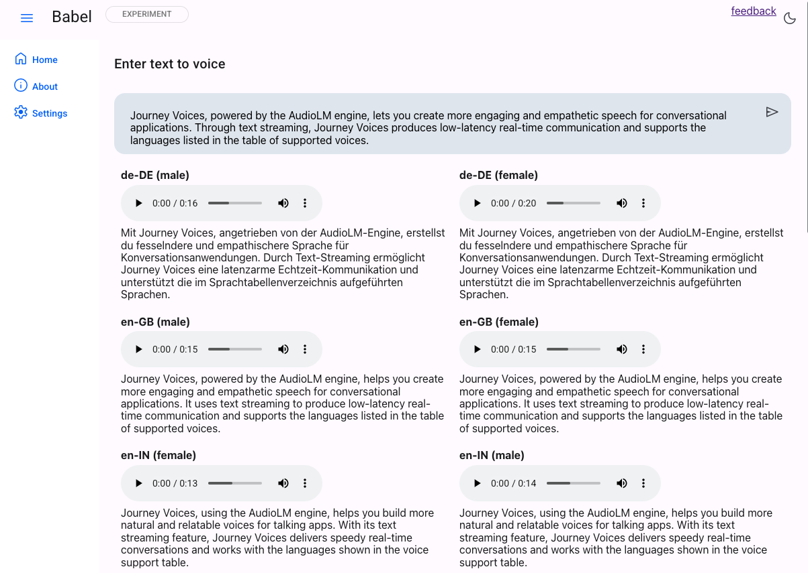
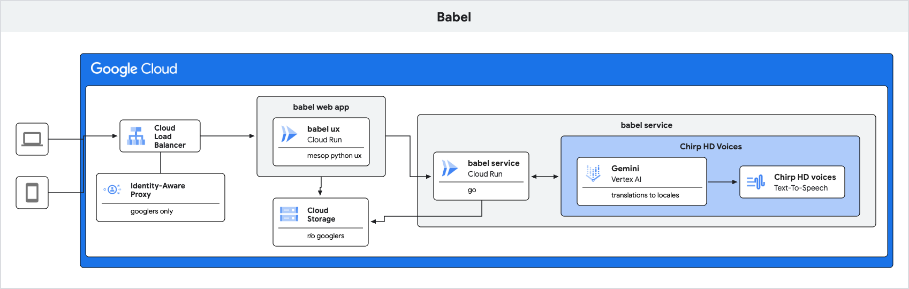

# Babel

Given a sentence or paragraph, Babel generates audio in all Chirp 3: HD voices and locales, including translation to the proper locale.

Babel has a command-line, a service endpoint, and a Mesop UX webapp that uses the service.

This is a stand-alone implementation which will be incorporated into GenMedia Studio's Fabulae component in the future.


## Command-line

You can use babel via the command-line (once built, see below):

```
> export PROJECT_ID=$(gcloud config get project)

> babel "how are you doing there?"

2024/10/19 09:51:05 17 Journey voices
2024/10/19 09:51:05 original statement: how are you doing there?
- translating statement ...  [1s]
\ generating audio ...  [1s]
2024/10/19 09:51:08 complete. wrote 17 files
```


### Build the command-line app

Use Go to build the command-line app.

```
go build
```

This will output a `babel` binary for use.


## Service - as a web service

You can use babel as a web service for your front-end apps.

The service consists of 2 endpoints

* `/babel` - return audio for each Chirp 3: HD voice locale, given the statement
* `/voices` - return a list of all available Chirp HD voice locales


To run this locally, provide a `PROJECT_ID` a GCS bucket for the generated voices `BABEL_BUCKET` and, optionally, the path within that bucket `BABEL_PATH` (will default to `babel`).


```
export PROJECT_ID=$(gcloud config get project)
export BABEL_BUCKET=$PROJECT_ID-fabulae
export BABEL_PATH=babel

babel --service=true

2024/10/19 09:52:56 17 Journey voices
2024/10/19 09:52:56 using gs://ghchinoy-genai-sa-fabulae/babel
```

In another terminal: 
```
curl localhost:8080/babel -d '{"statement":"hi there can you tell me your name"}' -sS | jq .

{
    "audio_metadata": [
        {
            "voice_name": "en-US-Journey-D",
            "language_code": "en-US",
            "text": "Hey, what's your name? \n",
            "audio_path": "20241019.051035.24-en-US-Journey-D-en-US-MALE.wav"
        },
        {
            "voice_name": "fr-CA-Journey-D",
            "language_code": "fr-CA",
            "text": "Salut, t'es qui toi? \n",
            "audio_path": "20241019.051035.24-fr-CA-Journey-D-fr-CA-MALE.wav"
        },
        {
            "voice_name": "en-IN-Journey-F",
            "language_code": "en-IN",
            "text": "Abey, tera naam kya hai? \n",
            "audio_path": "20241019.051035.24-en-IN-Journey-F-en-IN-FEMALE.wav"
        }
    ...

```

### Deploy to Cloud Run

To deploy the service to Cloud Run, you'll need a few environment variables set

* `PROJECT_ID` - a Google Cloud Project ID, which you can set like so: `export PROJECT_ID=$(gcloud config get project)`
* `BABEL_BUCKET` - a Google Cloud Storage bucket path, to store generated audio files, without the `gs://` prefix; something like `export BABEL_BUCKET=${PROJECT_ID}-fabulae/babel`
* `SERVICE` - this flag indicates you want to run Babel as a service, and not the command, line; `export SERVICE=true`
* `SA_ID` - a service account, see below to create the service account.

```
gcloud run deploy babel-fabulae --source . --no-allow-unauthenticated \
  --set-env-vars=PROJECT_ID=$(gcloud config get project) \
  --set-env-vars=BABEL_BUCKET=${BABEL_BUCKET} \
  --set-env-vars=SERVICE=true \
  --service-account $SA_ID
```

Once deployed, the service URL will be returned

Test with an identity token

```
export SERVICE_URL=https://babel-fabulae-1234.us-central1.run.app
export TOKEN=$(gcloud auth print-identity-token)

curl -d '{"statement": "how are you doing today? its a lovely saturday and Im just trying out a bunch of newly released speech voices"}' -H "Authorization: Bearer ${TOKEN}" ${SERVICE_URL}/babel
```


### Create a service account


```
export PROJECT_ID=$(gcloud info --format='value(config.project)')

export DESC="audio stories"
export SA_NAME="sa-fabulae"
export SA_ID=${SA_NAME}@${PROJECT_ID}.iam.gserviceaccount.com

# create a service account
gcloud iam service-accounts create $SA_NAME --description $DESC --display-name $SA_NAME

# assign vertex and cloud run roles
gcloud projects add-iam-policy-binding $PROJECT_ID --member="serviceAccount:${SA_ID}" --role "roles/aiplatform.user" 
gcloud projects add-iam-policy-binding $PROJECT_ID --member="serviceAccount:${SA_ID}" --role "roles/run.invoker"
gcloud projects add-iam-policy-binding $PROJECT_ID --member="serviceAccount:${SA_ID}" --role "roles/storage.objectCreator"
gcloud projects add-iam-policy-binding $PROJECT_ID --member="serviceAccount:${SA_ID}" --role "roles/storage.objectViewer"
```


## Web app

Babel also has a front-end web app, written in [Mesop](https://mesop-dev.github.io/mesop/), a Python UX.

The web app is in the `app` folder.

Here we use [uv](https://github.com/astral-sh/uv) as the Python package manager, but you can also use whatever you'd like.


```
cd app
# establish a virtual environment for python
# uv venv venv && . venv/bin/activate && uv pip install -r requirements.txt

# note no gs:// and trailing /
export BABEL_BUCKET=ghchinoy-genai-sa-fabulae/babel/ 
# endpoint (can be Cloud Run, defaults to http://localhost:8080)
export SYNTHESIS_ENDPOINT=http://localhost:8080

# start mesop server
# we're not using the traditional `mesop main.py` since we're using FastAPI
DEBUG_MODE=true uv run main.py
```

Please note, for local deployment, start the babel service first and specify the `BABEL_ENDPOINT` environment variable.





### Create a service account


```
export PROJECT_ID=$(gcloud info --format='value(config.project)')

export DESC="audio stories"
export SA_NAME="sa-fabulae"
export SA_ID=${SA_NAME}@${PROJECT_ID}.iam.gserviceaccount.com

# create a service account
gcloud iam service-accounts create $SA_NAME --description $DESC --display-name $SA_NAME

# assign vertex and cloud run roles
gcloud projects add-iam-policy-binding $PROJECT_ID --member="serviceAccount:${SA_ID}" --role "roles/aiplatform.user" 
gcloud projects add-iam-policy-binding $PROJECT_ID --member="serviceAccount:${SA_ID}" --role "roles/run.invoker"
gcloud projects add-iam-policy-binding $PROJECT_ID --member="serviceAccount:${SA_ID}" --role "roles/storage.objectCreator"
gcloud projects add-iam-policy-binding $PROJECT_ID --member="serviceAccount:${SA_ID}" --role "roles/storage.objectViewer"
```

### Deploy

Deploy to Cloud Run from source, with a service account, and the `BABEL_ENDPOINT`, `PROJECT_ID`, and `GENMEDIA_BUCKET` environment variables.

Please note that the deployment command below is an open endpoint. Protect this with IAP+Load Balancer or another method of auth, of your choosing.


```
# SA_ID service account from above
# PROJECT_ID
export PROJECT_ID=$(gcloud config get project)
# GENMEDIA_BUCKET without the gs:// but with / if it's a folder
export GENMEDIA_BUCKET=${PROJECT_ID}-fabulae/babel/
# BABEL_ENDPOINT, change this to your Babel service endpoint
export BABEL_ENDPOINT=https://babel-fabulae-1234.us-central1.run.app # change this

gcloud run deploy babel-ux --source . \
  --allow-unauthenticated \
  --region us-central1 \
  --service-account $SA_ID \
  --update-env-vars=SYNTHESIS_ENDPOINT=${BABEL_ENDPOINT} \
  --update-env-vars=PROJECT_ID=${PROJECT_ID} \
  --update-env-vars=GENMEDIA_BUCKET=${GENMEDIA_BUCKET}
```

You may also use an `.env` file to specify these. If you do, the `.env` file values will override any Cloud Run environment variables.

Example `.env` file (see also blank envfile.example)


```
#BABEL_ENDPOINT=http://localhost:8080
BABEL_ENDPOINT=https://YOUR_CLOUD_RUN_ENDPOINT
PROJECT_ID=YOUR_PROJECT_ID
LOCATION=us-central1
GENMEDIA_BUCKET=YOUR_BUCKET_WITH_PATH
```

