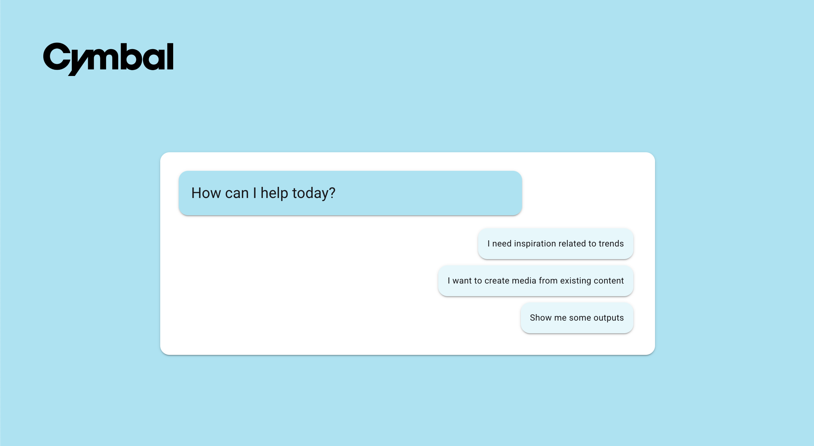
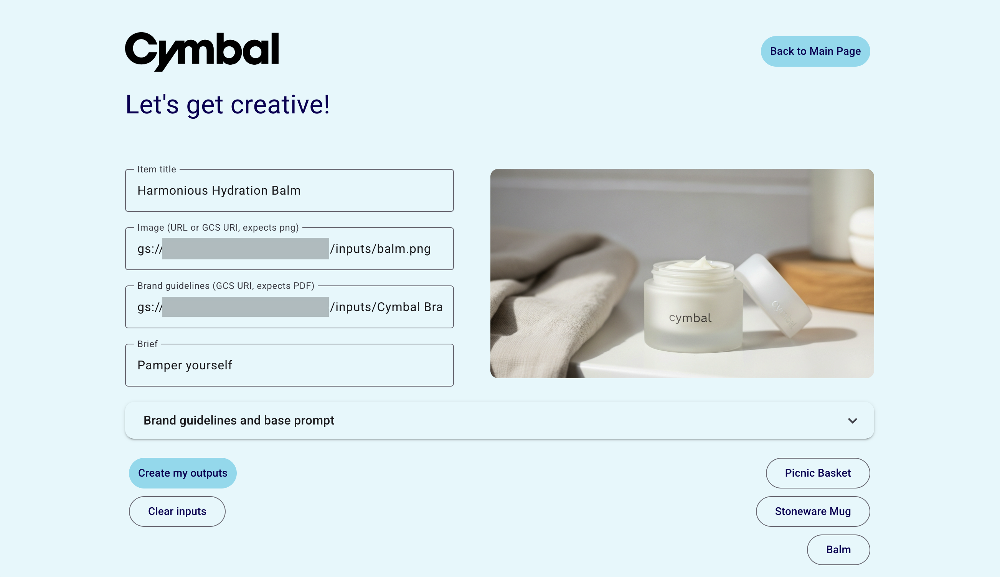
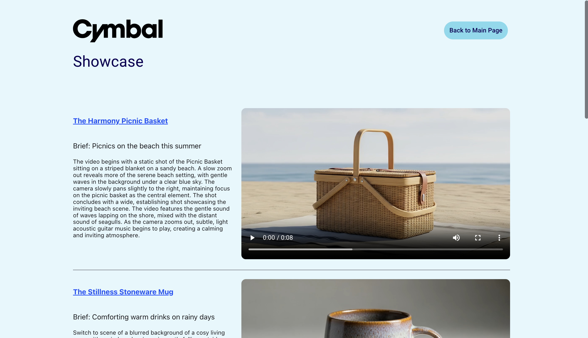

# GenMedia Creative Workflow demo

The primary purpose of this demo is to showcase a tangible, end-to-end workflow that uses GenAI to solve a real-world creative challenge. It's designed to move beyond simple, one-off AI generations and demonstrate how a series of interconnected AI tools can be orchestrated to produce high-quality, on-brand creative media.

The demo does the following:
- Takes initial inputs - product details, images, brand guidelines, and a simple brief - and transforms them into a concrete creative output: a detailed video prompt ready for generation with a tool like [Veo 3](https://cloud.google.com/vertex-ai/generative-ai/docs/models#veo-models).
- Includes a showcase to display pre-made examples, which is crucial for demonstrating the final output without the delay of live video generation.

This app is built with [Mesop](https://mesop-dev.github.io/mesop/), a Python-based UI framework that enables you to rapidly build web apps like this demo and internal apps. 

Created using:
```
mesop                    1.0.1
google-genai             1.20.0
```

## Screenshots







## Run locally

Requires the following environment variables:
```
export PROJECT_ID=YOUR_PROJECT_ID
export LOCATION=YOUR_LOCATION
export BUCKET=YOUR_BUCKET
```
Requires the following structure in your Google Cloud Storage bucket, where `inputs` contains images and a brand guidelines document you will use as input to the workflow and `outputs` contains sample output videos:
```
$YOUR_BUCKET
├── inputs
│   ├── brand_guidelines_doc.pdf
│   ├── product_image1.png
│   ├── product_image2.png
│   └── product_image3.png
└── outputs
    ├── sample_output_video1.mp4
    ├── sample_output_video2.mp4
    ├── sample_output_video3.mp4
    └── showcase_outputs.csv
```
The Showcase page uses the `outputs/showcase_outputs.csv` file which has details of the showcase videos to include. It uses the following format (note that the app expects these titles as-is):
```
item_url,title,brief,prompt,video_uri
https://cymbal.com/item,Item title,Brief details,Prompt used,uri-here
```
Then follow the [instructions in the README](https://github.com/GoogleCloudPlatform/vertex-ai-creative-studio?tab=readme-ov-file#create-virtual-environment) at the top level of this repo.

## Deploy to Cloud Run

Similarly, using the environment variables and GCS bucket structure detailed above, follow the [instructions in the README](https://github.com/GoogleCloudPlatform/vertex-ai-creative-studio?tab=readme-ov-file#deploy-to-cloud-run) at the top level of this repo.

## Disclaimer

This is not an officially supported Google product. This project is intended for demonstration purposes only. It is not intended for use in a production environment.