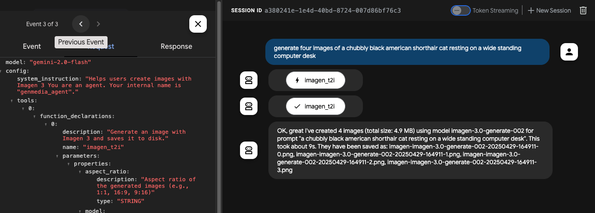

# ADK sample

This directory contains a Google Cloud Vertex AI Agent Development Kit sample agent that uses the MCP genmedia tools.

## Prerequisites

Install the MCP Servers for Genmedia tools. This example uses the Go versions and assumes you've installed them locally.

## Setup

Add an .env file to the `genmedia_agent` agent directory:

```bash
GOOGLE_CLOUD_PROJECT="your-project-id"
GOOGLE_CLOUD_LOCATION="your-location" #e.g. us-central1
GOOGLE_GENAI_USE_VERTEXAI="True"
```

## Start the Imagen MCP Server

The agent example contains two MCP servers using STDIO (Veo, Chirp 3) and one using the SSE protocol (Imagen).

Start the Imagen MCP Server in a separate terminal:

```bash
export PROJECT_ID=$(gcloud config get project)
mcp-imagen-go --transport sse
```


## Run the ADK Developer UI

In this dir, start the adk web debug UX:

```bash
uv sync
source .venv/bin/activate
adk web
```

