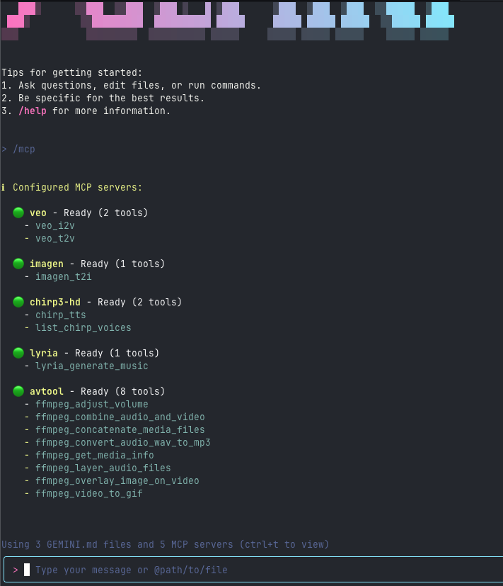

# MCP Servers for Genmedia x Gemini CLI

Use the MCP Servers for Genmedia with the [Gemini CLI](https://github.com/google-gemini/gemini-cli) ([launch announcement blog post](https://blog.google/technology/developers/introducing-gemini-cli-open-source-ai-agent/))


 
([full video](https://storage.googleapis.com/gweb-uniblog-publish-prod/original_videos/GenMedia_demo_keyword.mp4))


To install these MCP servers, please see [Installation](../../mcp-genmedia-go/README.md).

To configure these servers for gemini cli, you can either add these to your ~/.gemini/settings.json (see [Configuration](https://github.com/google-gemini/gemini-cli/blob/main/docs/cli/configuration.md#available-settings-in-settingsjson)) or create an Extension (preferred, [Extensions](https://github.com/google-gemini/gemini-cli/blob/main/docs/extension.md)).

## .gemini/settings.json: mcpServers

Add the following to your .gemini/settings.json `mcpServers` - you can do this at your ~/.gemini or per project directory.

A `sample_settings.json` is provided for your convenience.

```json
{
  "mcpServers": {
    "veo": {
      "command": "mcp-veo-go",
      "env": {
        "MCP_REQUEST_MAX_TOTAL_TIMEOUT": "240000",
        "MCP_SERVER_REQUEST_TIMEOUT": "30000",
        "GENMEDIA_BUCKET": "YOUR_GOOGLE_CLOUD_STORGE_BUCKET",
        "PROJECT_ID": "YOUR_GOOGLE_CLOUD_PROJECT_ID"
      }
    },
    "imagen": {
      "command": "mcp-imagen-go",
      "env": {
        "MCP_SERVER_REQUEST_TIMEOUT": "55000",
        "GENMEDIA_BUCKET": "YOUR_GOOGLE_CLOUD_STORGE_BUCKET",
        "PROJECT_ID": "YOUR_GOOGLE_CLOUD_PROJECT_ID"
      }
    },
    "chirp3-hd": {
      "command": "mcp-chirp3-go",
      "env": {
        "MCP_SERVER_REQUEST_TIMEOUT": "55000",
        "GENMEDIA_BUCKET": "YOUR_GOOGLE_CLOUD_STORGE_BUCKET",
        "PROJECT_ID": "YOUR_GOOGLE_CLOUD_PROJECT_ID"
      }
    },
    "lyria": {
      "command": "mcp-lyria-go",
      "env": {
        "GENMEDIA_BUCKET": "YOUR_GOOGLE_CLOUD_STORGE_BUCKET",
        "PROJECT_ID": "YOUR_GOOGLE_CLOUD_PROJECT_ID",
        "MCP_SERVER_REQUEST_TIMEOUT": "55000"
      }
    },
    "avtool": {
      "command": "mcp-avtool-go",
      "env": {
        "PROJECT_ID": "YOUR_GOOGLE_CLOUD_PROJECT_ID",
        "MCP_SERVER_REQUEST_TIMEOUT": "55000"
      }
    }
  }
}
```

Please note, you can add `"trust": true` to any of the MCP Servers to allow trusting the MCP server and its tools to bypass confirmations. See the [Configuration docs](https://github.com/google-gemini/gemini-cli/blob/main/docs/cli/configuration.md).


## .gemini/extensions/google-genmedia Extension

[Extensions](https://github.com/google-gemini/gemini-cli/blob/main/docs/extension.md) are the way to extend the gemini cli capabilities and bundle MCP servers.


First, create a directory for your extension - this can be at the home directory level (below), or per project directory.

```bash
mkdir -p ~/.gemini/extensions/google-genmedia-extension/
```

A `sample_extensions` directory is provided for your convenience.

Then, add to that directory a `gemini-extension.json`

```json
{
  "name": "google-genmedia-extension",
  "version": "1.0.0",

  "mcpServers": {
    "veo": {
      "command": "mcp-veo-go",
      "env": {
        "MCP_REQUEST_MAX_TOTAL_TIMEOUT": "240000",
        "MCP_SERVER_REQUEST_TIMEOUT": "30000",
        "GENMEDIA_BUCKET": "YOUR_GOOGLE_CLOUD_STORGE_BUCKET",
        "PROJECT_ID": "YOUR_GOOGLE_CLOUD_PROJECT_ID"
      }
    },
    "imagen": {
      "command": "mcp-imagen-go",
      "env": {
        "MCP_SERVER_REQUEST_TIMEOUT": "55000",
        "GENMEDIA_BUCKET": "YOUR_GOOGLE_CLOUD_STORGE_BUCKET",
        "PROJECT_ID": "YOUR_GOOGLE_CLOUD_PROJECT_ID"
      }
    },
    "chirp3-hd": {
      "command": "mcp-chirp3-go",
      "env": {
        "MCP_SERVER_REQUEST_TIMEOUT": "55000",
        "GENMEDIA_BUCKET": "YOUR_GOOGLE_CLOUD_STORGE_BUCKET",
        "PROJECT_ID": "YOUR_GOOGLE_CLOUD_PROJECT_ID"
      }
    },
    "lyria": {
      "command": "mcp-lyria-go",
      "env": {
        "GENMEDIA_BUCKET": "YOUR_GOOGLE_CLOUD_STORGE_BUCKET",
        "PROJECT_ID": "YOUR_GOOGLE_CLOUD_PROJECT_ID",
        "MCP_SERVER_REQUEST_TIMEOUT": "55000"
      }
    },
    "avtool": {
      "command": "mcp-avtool-go",
      "env": {
        "PROJECT_ID": "YOUR_GOOGLE_CLOUD_PROJECT_ID",
        "MCP_SERVER_REQUEST_TIMEOUT": "55000"
      }
    }
  }
}
```

Now, when you start up gemini cli you should see the mpc servers listed when issuing the slash command, `/mcp`

