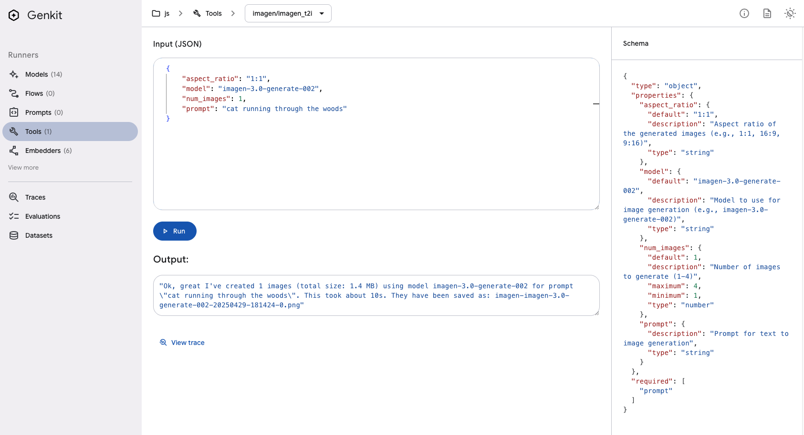

# Genkit Genmedia MCP client

Example [Genkit](https://firebase.google.com/docs/genkit) AI application using Genmedia MCP servers.


## Prerequisites

* NodeJs (You can use the [nvm](https://github.com/nvm-sh/nvm) node manager to install this)

Install Genkit client

```bash
npm install -D genkit-cli
```

## Run Genkit MCP client

Genkit js genmedia MCP client

```bash
cd genkit-agent-js
npm i
npm run start
```

Open Genkit dev tools at localhost:4000



