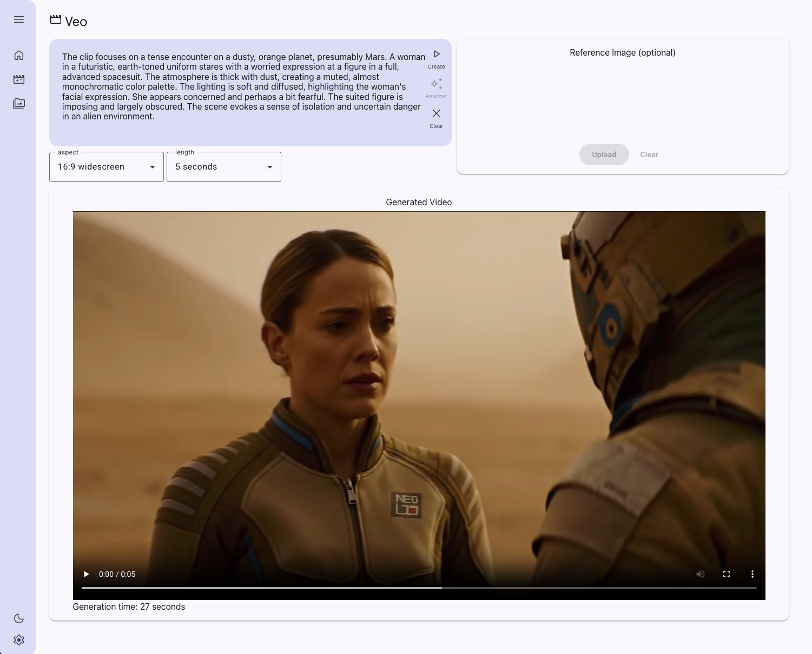

# Experiment: Veo 2 app

This is the initial experiment for the Veo 2 addition to Vertex AI GenMedia Creative Studio.




Current featureset
* Text to Video: Create a video from a prompt.
* Image to Video: Create a video from an image + prompt.
* Library: Display the previous stored videos from Firestore index
* Veo 2 settings/features: Aspect ratio, Duration, Auto prompt enhancer


Future featureset

* Prompt rewriter
* Additional Veo 2 features: seed, negative prompt, person generation control
* Advanced Veo 2 features
* Integration into main GenMedia Creative Studio


This is built using [Mesop](https://mesop-dev.github.io/mesop/) with [scaffold for Studio style apps](https://github.com/ghchinoy/studio-scaffold).


## Prerequisites

You'll need the following
* This source
* Google Cloud Storage bucket to store media
* Firestore database to store the index for the Library
* To run this locally, you'll also need a python virtual environment set up.
* Application environment variables set


### Source

For this experiment, download the source and then change to this directory

```bash
git clone https://github.com/GoogleCloudPlatform/vertex-ai-creative-studio.git
cd vertex-ai-creative-studio/
git checkout veo
cd experiments/veo-app/
```

### Google Cloud Storage bucket

You'll need a Google Cloud Storage bucket to hold the videos created and images uploaded.

By default, if you don't specify a bucket name in one of the applicaiton environment variables below, it'll be "`YOUR_PROJECT_NAME`-assets".

You can create this like so:

```bash
export PROJECT_ID=$(gcloud config get project)
gcloud storage mb -l us-central gs://${PROJECT_ID}-assets
```


### Cloud Firestore

We will be using [Cloud Firestore](https://firebase.google.com/docs/firestore), a NoSQL cloud database that is part of the Firebase ecosystem and built on Google Cloud infrastructure, to save generated video metadata for the Library.

> If you're new to Firebase, a great starting point is [here](https://firebase.google.com/docs/projects/learn-more#firebase-cloud-relationship).

Go to your Firebase project and create a database. Instructions on how to do this can be found [here](https://firebase.google.com/docs/firestore/quickstart).

Next do the following steps:

* Create a collection called `genmedia`. This is the default collection name. 

The name of the collection can be changed via environment variables in the `.env` file, by setting the environment variable `GENMEDIA_COLLECTIONS_NAME` to your chosen collection name.


### Python virtual environment

A python virtual environment, with required packages installed.

Using the [uv](https://github.com/astral-sh/uv) virtual environment and package manager:

```
# sync the requirements to a virtual environment
uv sync
```

If you've done this before, you can also use the command `uv sync --upgrade` to check for any package version upgrades.


### Application Environment variables

Use the included dotenv.template and create a `.env` file with your specific environment variables. 

Only one environment variable is required:

* `PROJECT_ID` your Google Cloud Project ID, obtained via `gcloud config get project`


See the template dotenv.template file for the defaults and what environment variable options are available.


## GenMedia Creative Studio - Veo 2 Studio


### Running

Once you have your environment variables set, either on the command line or an in .env file:

```bash
uv run main.py
```


### Other ways of running

Use Cloud Shell and follow the tutorial instructions.


  [](https://shell.cloud.google.com/cloudshell/editor?cloudshell_git_repo=https://github.com/GoogleCloudPlatform/vertex-ai-creative-studio.git&cloudshell_git_branch=veo&cloudshell_workspace=experiments/veo-app&cloudshell_tutorial=tutorial.md)


### Developing

Using the mesop app in a virtual environment provides the best debugging and building experience as it supports hot reload.

```bash
source .venv/bin/activate
```

Start the app, use the mesop command in your python virutal environment

```bash
mesop main.py
```


# Disclaimer

This is not an officially supported Google product.