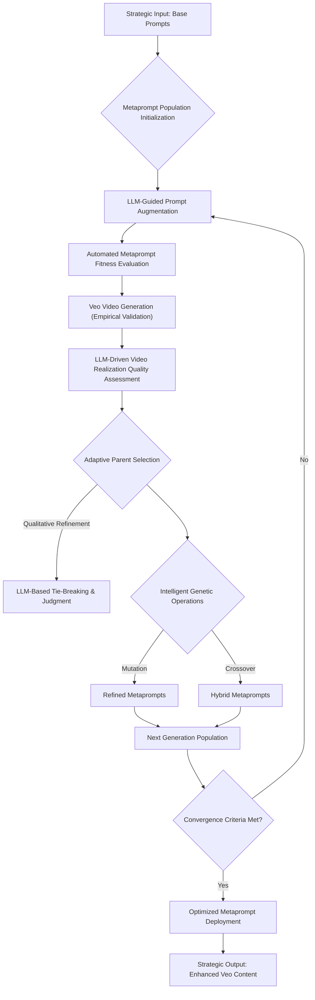

# Strategic Imperative: Evolutionary Prompt Optimization for Veo Generative AI

**1. Executive Summary: Strategic Imperative for Automated Prompt Engineering for Veo**
*   High-level overview of the challenge and our innovative solution for Veo.
*   Emphasis on business impact: quality, efficiency, and competitive advantage in Veo content generation.

**2. Problem Statement: Optimizing Veo Prompt Rewriting for Task-Specific Excellence**
*   **2.1. The Core Challenge**: We possess a defined corpus of base Veo prompts (`original_prompts.json`) intended for specific generative tasks.
*   **2.2. The Initial State**: Our starting point is a foundational, generic metaprompt (e.g., `original_metaprompt = "make following prompt better"`). This metaprompt guides an LLM to augment our base prompts for Veo.
*   **2.3. The Optimization Objective**: Our critical goal is to discover and converge upon an *optimal metaprompt*. This optimal metaprompt must consistently rewrite our base Veo prompts into highly effective, task-specific augmented prompts, thereby maximizing Veo's output fidelity and overall impact for our defined use cases.

**3. The Prompt Engineering Challenge: A Bottleneck in Veo Scale**
*   **3.1. The Nuance of Veo Prompts**: Why crafting effective prompts for Veo is inherently complex.
*   **3.2. Limitations of Manual Iteration**: The non-scalable nature of human-in-the-loop prompt refinement for Veo.
*   **3.3. Our Strategic Response**: Introducing evolutionary optimization as a systematic solution for Veo.

**4. Foundational Concepts: Understanding Evolutionary Algorithms**
*   **4.1. Introduction to Genetic Algorithms (GAs)**: A concise explanation of GA principles for an engineering audience.
*   **4.2. Core GA Components**:
    *   **Population**: The set of candidate solutions (metaprompts).
    *   **Fitness Function**: The objective measure of solution quality.
    *   **Selection**: Mechanisms for choosing high-performing individuals.
    *   **Genetic Operators**: Mutation and Crossover for generating new solutions.
    *   **Generations**: The iterative cycle of evolution.
*   **4.3. Why GAs for Veo Prompt Optimization?**: The rationale for applying evolutionary principles to this problem space.

**5. The Veo Prompt Optimization Pipeline: A Systemic Deep Dive**
*   **5.1. Pipeline Overview (Mermaid Diagram)**: A visual representation of the end-to-end process.

*   **5.2. Phase 1: Metaprompt Population Initialization**: How we seed the evolutionary process with diverse candidates.
*   **5.3. Phase 2: LLM-Guided Prompt Augmentation**: The role of the metaprompt in transforming raw user intent into Veo-optimized prompts, leveraging `veo_guide.md`.
*   **5.4. Phase 3: Multi-Objective Fitness Evaluation (LLM-as-a-Judge for Prompts)**:
    *   **Automated Autorating via Vertex AI GenAI Eval Service**: This service is leveraged for robust, automated evaluation of text-based prompts and metaprompts. It employs LLMs (specifically Gemini) as "autoraters" to score and provide detailed explanations based on predefined metric templates (`veo_prompt_eval_templates`).
    *   **Key Metrics and Their Role**:
        *   **Instructional Efficacy of Metaprompts**: Pointwise evaluation of the metaprompt itself, assessing its clarity, completeness, and adherence to `veo_guide.md` principles as an instruction set.
        *   **Augmented Prompt Quality**: Pointwise evaluation of the prompts generated *by* the metaprompt, assessing their intrinsic quality, richness of detail, effective use of cinematic language, and overall suitability for Veo.
        *   **Intent Fidelity**: Pointwise evaluation ensuring the augmented prompt accurately preserves the core meaning and intent of the original user prompt.
    *   **Reliability Considerations**:
        *   **`sampling_count`**: While the current implementation in `prompt_optimizer.py` uses `sampling_count=1` for these prompt evaluations, the principle of `sampling_count` involves executing multiple independent evaluation runs for each prompt/metaprompt and averaging the scores. This technique mitigates the inherent stochasticity in LLM responses, leading to more reliable and robust fitness scores when configured for higher values.
    *   **Weighted Scoring**: The scores from these diverse metrics are aggregated into a unified combined fitness score, which directly drives the evolutionary selection process.

*   **5.5. Phase 4: Empirical Veo Video Generation**: Augmented prompts are materialized into actual video outputs via the Veo API. This phase also supports **image-to-video generation**. This provides empirical ground truth for downstream validation and enables comparative analysis against baseline (original prompt) video outputs.

*   **5.6. Phase 5: Veo Video Realization Quality Assessment (LLM-as-a-Judge for Videos)**:
    *   **Direct Gemini Autorater for Pairwise Comparison (for Best Parents)**: For video evaluation, a dedicated Gemini model is directly invoked as an autorater. This evaluation is performed specifically for the videos generated from the *best selected parents* of each generation. The model receives the original prompt and the generated video pair (original vs. optimized) and assesses which video better realizes the prompt and exhibits superior quality.
    *   **Reliability Enhancements**:
        *   **`sampling_count`**: Multiple independent evaluations are performed to average out variability and increase confidence in the judgment.
        *   **`flip_enabled`**: Crucially, for pairwise comparisons, the order of videos (e.g., Video A vs. Video B) is randomly flipped across different evaluation runs. This technique directly counteracts potential positional bias in the LLM's judgment, ensuring a more objective and fair comparison.
    *   **Feedback Loop**: The qualitative explanations (`reasoning`) provided by these video evaluations, while not directly contributing to the numerical fitness score, offer crucial insights that are explicitly captured and used to inform the LLM's behavior in subsequent genetic operations.

*   **5.7. Phase 6: Adaptive Selection & Intelligent Reproduction**:
    *   **Parent Selection**: High-performing metaprompts are selected based on their combined fitness scores.
    *   **LLM-Based Judgment for Tie-Breaking**: When multiple metaprompts exhibit similar combined fitness scores, an LLM (Gemini) acts as a "judge" (`_get_selection_from_gemini`). This is a *custom Gemini call* with a specific prompt and schema, distinct from the Vertex AI Eval Service's pairwise prompt evaluation. This judge analyzes the detailed evaluation explanations (e.g., `augmented_prompt_explanation`, `intent_preservation_explanation`, `metaprompt_explanation`) and applies a predefined rubric to make a qualitative, nuanced selection of the most promising parents. This ensures that subtle qualitative advantages are captured and propagated.
    *   **Generative Operators Informed by Comprehensive Feedback**:
        *   **Mutation**: An LLM refines a parent metaprompt. The `mutation_prompt` explicitly incorporates the detailed evaluation explanations (e.g., "Augmented Prompt Feedback", "Intent Preservation Feedback", "Instructional Quality Feedback") *and the video evaluation feedback from the best parent* to guide the LLM in fixing identified weaknesses and enhancing strengths.
        *   **Crossover**: An LLM combines two parent metaprompts. The `crossover_prompt` also leverages these detailed evaluation explanations from both parents *and the video evaluation feedback from the best parent* to intelligently merge their best qualities, fostering the creation of superior hybrid metaprompts.

**6. Technical Innovations and Differentiators**
*   **6.1. LLM-in-the-Loop Genetic Operations**: A novel approach to intelligent mutation, crossover, and judgment, moving beyond traditional symbolic GA operators.
*   **6.2. Comprehensive Multi-Objective Fitness Function**: Tailored specifically for the complexities and multi-faceted nature of Veo prompts.
*   **6.3. Integrated Evaluation Framework**: Seamless integration with Vertex AI GenAI Eval Service and direct Gemini API calls for robust, reliable, and scalable assessment.
*   **6.4. Closed-Loop Automation**: Minimizing manual intervention and accelerating iteration cycles for continuous improvement.

**7. Strategic Impact and Future Directions**
*   **7.1. Accelerated Product Development**: Faster iteration and deployment of new Veo capabilities.
*   **7.2. Enhanced Content Quality**: Driving superior visual and narrative outputs from Veo.
*   **7.3. Operational Efficiency Gains**: Reducing engineering overhead in Veo prompt optimization.
*   **7.4. Adaptability and Future-Proofing**: The system's inherent ability to evolve with new Veo models and guidelines.
*   **7.5. Roadmap and Potential Expansions**: Future applications and enhancements of this framework for Veo.
